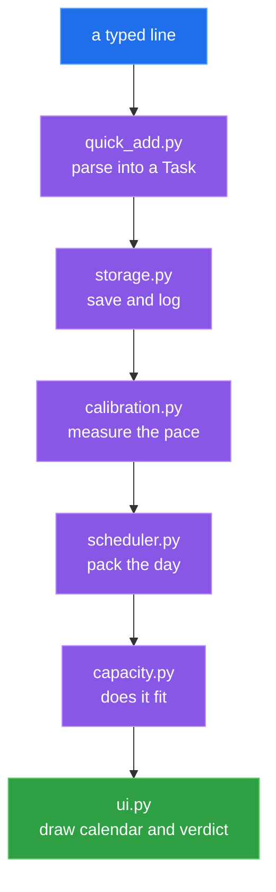
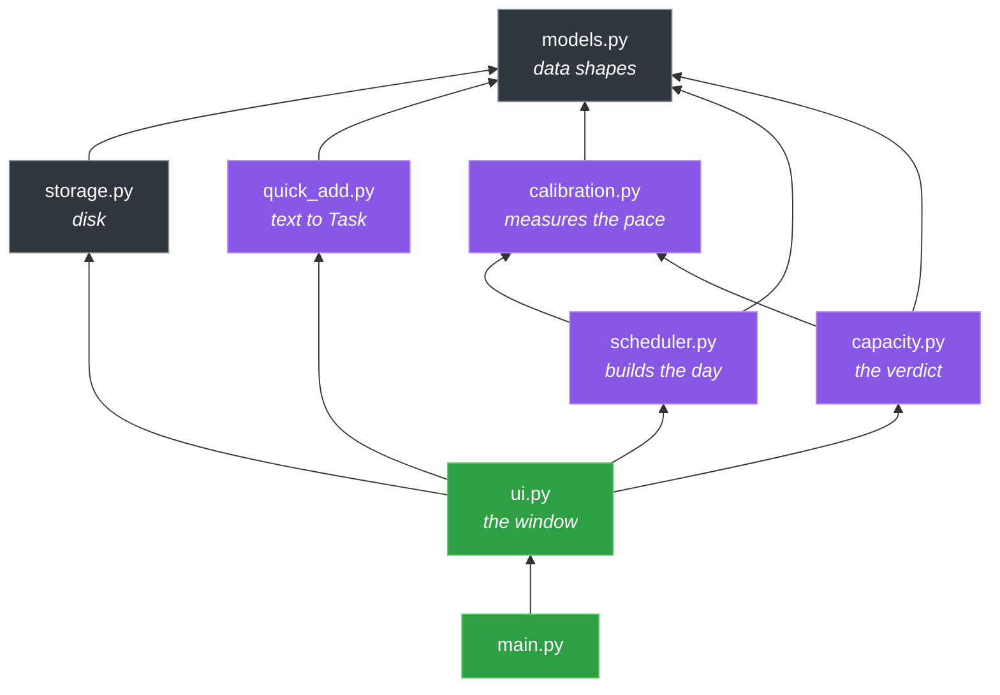

<div align="center">

# Secretary

**A to-do list that builds a calendar from itself, then reports whether the day actually fits.**


</div>

---

## Run

```bash
python main.py
```

Standard library only, runs offline.

---

## The idea

- A to-do list is a set of things
- A calendar is a schedule of things
- Converting one into the other needs a capacity figure

Capacity here means the minutes actually finished in a day, measured from completed work.

> [!IMPORTANT]
> Every message quotes the numbers behind it, such as `"6h 40m planned against a usual 4h 10m"`.

---

## Adding tasks

One text box. Type, press <kbd>Enter</kbd>.

```
write essay intro 90m tomorrow #writing !1 ~deep
dentist 30m +4d at 2pm
email landlord 10m today #admin ~light
call mum
```

| token | meaning |
|:--|:--|
| `90m` `45min` `2h` `1.5h` | estimated duration |
| `today` `tomorrow` | due date |
| `mon`…`sun` | next such weekday |
| `+3d` | days from now |
| `2026-08-12` | exact date |
| `at 2pm` `2:30pm` `14:00` `@2pm` | fixed clock time |
| `#writing` | category, drives calibration |
| `!1` `!2` `!3` | must / should / maybe |
| `~light` `~normal` `~deep` | concentration needed |

- Order does not matter
- Everything optional except the words
- No duration means 30m assumed, and it says so

> [!WARNING]
> A clock time needs am/pm or a colon, so `read chapter 2` keeps its `2`.
> Day words are always read as dates: `call Monday about the flat` becomes `call about the flat`.

---

## How a day is built



1. Carve the day: working hours minus fixed commitments
2. Pick tasks: pinned here, or due by now
3. Fixed times first, `at 2pm` claims 14:00 and is cut out like lunch
4. Deep work, only inside the deep-work window
5. Everything else, earliest gap that fits
6. Breaks, 10 minutes after every 90 unbroken
7. Fill leftovers, stopping at capacity rather than at 6pm

> [!IMPORTANT]
> Step 7 uses the measured capacity as the cut-off, so a full calendar stays a doable one.

---

## What learning means

Two medians, measured from finished tasks.

```diff
+ estimation multiplier   median(actual / estimated), per category
+ daily capacity          median(minutes finished per working day)
```

```diff
  Typed:           write essay intro 90m

- Before learning: 09:00-10:30   90m, taken as given
+ After learning:  09:00-11:30   150m, #writing runs 1.67x

- Before: "Reasonable: 3h 30m of an assumed 5h."
+ After:  "Slightly over: 5h 10m planned against a usual 4h 40m."
```

| guard | value |
|:--|:--|
| minimum samples per category | 3 |
| minimum working days for capacity | 3 |
| history window | 21 days |
| multiplier clamped to | 0.5x – 3.0x |
| days with nothing finished | ignored, not counted as zero |

> [!CAUTION]
> The `Done` prompt supplies every piece of calibration data. Answer it accurately or the numbers stay meaningless.

Fixed-time tasks skip the multiplier, since an appointment's length is already known.

---

## Colour code

| colour | meaning |
|:--|:--|
| red | overdue |
| orange | did not fit in the day |
| purple | pushed back 3+ times |
| grey | finished |

Calendar blocks are coloured by energy: blue deep, teal normal, grey light, yellow break, dark grey fixed commitment. A red line marks now.

---

## Architecture



Arrows point downward only. `ui.py` imports from everything below it; `models.py` imports from none of them.

---

# The code

## `models.py`

The data shapes everything else speaks in. No disk, no window, no clock.

**Task**
- `is_overdue()` — unfinished, past its due date
- `is_due_on_or_before()` — deadline lands on or before a day
- `due_date_for_sorting()` — due date, or `9999-12-31` if none
- `short_description()` — `"title (90m, deep)"`
- `has_fixed_time()` — named a clock time
- `to_dictionary()` / `from_dictionary()` — JSON out / in

**ScheduledBlock**
- `duration_minutes` — end minus start
- `time_range_text()` — `"09:00-10:30"`

**DayPlan**
- `total_intended_minutes` — placed plus overflowed

**Module**
- `new_task_id()` — short unique id
- `create_task()` — the only place tasks are born
- `clock_to_minutes()` — `"09:30"` to `570`
- `minutes_to_clock()` — `570` to `"09:30"`
- `minutes_to_human()` — `95` to `"1h 35m"`
- `today_as_iso()` — today as a date string
- `now_as_text()` — timestamp
- `shift_iso_date()` — move a date n days
- `friendly_day_name()` — `"Today"`, `"Tomorrow"`, `"Tue 12 Aug"`

---

## `storage.py`

Everything that touches disk. Four files in `data/`.

- `ensure_data_directory()` — creates `data/`
- `_read_json()` — reads, falls back if corrupt
- `_write_json()` — writes, indented
- `load_settings()` / `save_settings()` — settings merged over defaults
- `load_tasks()` / `save_tasks()` — `tasks.json` in / out
- `record_event()` — appends one line to `events.jsonl`, never rewrites
- `load_events()` — reads history, skips half-written lines
- `load_all_notes()` — every day's note
- `get_note_for_day()` / `save_note_for_day()` — one day's note

> [!NOTE]
> `events.jsonl` has no reader yet. Later versions learn from history, so collection starts now.

---

## `quick_add.py`

Turns one typed line into a Task.

- `parse_quick_add()` — the parser, returns the Task plus what it recognised
- `_read_duration()` — `"90m"`, `"1.5h"` to minutes
- `_read_time()` — `"2pm"`, `"14:00"` to `"14:00"`
- `_read_date()` — `"tomorrow"`, `"fri"`, `"+3d"` to a date
- `_next_weekday()` — next date with that weekday

Matched tokens are always removed from the line, last of each kind wins, the rest is the title.

---

## `calibration.py`

Measures two numbers from finished tasks.

**Calibration**
- `multiplier_for()` — a category's multiplier, or the overall one
- `realistic_minutes_for()` — minutes the planner should book
- `describe()` — one line on what the numbers rest on
- `worst_estimated_categories()` — the largest estimation errors

**Module**
- `build_calibration()` — measures both numbers from scratch
- `_measure_daily_capacity()` — median minutes finished per day
- `_clamp_multiplier()` — keeps it inside 0.5x–3.0x
- `stalled_tasks()` — unfinished, deferred 3+ times

---

## `scheduler.py`

Turns tasks into a day. Touches no disk.

- `plan_day()` — the entry point, runs every pass, returns a DayPlan
- `place_fixed_time_tasks()` — gives `at 2pm` tasks their exact slot, records clashes
- `reserve_exact_interval()` — cuts an exact stretch out of free time, cannot fail
- `select_tasks_for_day()` — which tasks belong to a day
- `urgency_sort_key()` — overdue, deadline, priority, age
- `fill_spare_room()` — adds undated tasks, stops at capacity
- `build_free_intervals()` — working day minus fixed commitments
- `take_interval()` — claims the earliest gap that fits
- `add_break_if_needed()` — slips in a break after enough unbroken work
- `block_for_task()` — task to calendar block
- `fixed_commitment_blocks()` — lunch and friends as blocks

> [!TIP]
> `build_free_intervals` and `take_interval` are the placement engine. Those two explain the scheduler.

---

## `capacity.py`

Compares the day against capacity, turns the difference into a sentence.

**CapacityReport**
- `load_ratio` — intended over capacity
- `minutes_over_capacity` — how far past the limit
- `minutes_of_room_left` — slack remaining
- `is_over_capacity()` — ratio above 1.0

**Module**
- `build_capacity_report()` — the numbers behind every message
- `summarise_day()` — the status line, plus clash, overflow and stalled warnings
- `react_to_new_task()` — what to say when a task is added
- `_suggest_something_to_move()` — names the cheapest task to drop
- `_priority_word()` — `1` to `"a must"`

---

## `ui.py`

The tkinter window. Collects clicks, calls the other modules, draws the result. No scheduling or learning logic.

```python
SHOW_NOTES_PANEL      = False   # per-day note box
SHOW_LOAD_METER       = False   # how-full bar
SHOW_CALIBRATION_LINE = False   # grey "what it knows" line
SHOW_EXTRA_BUTTONS    = False   # push to tomorrow, pin, unpin
```

Flip any to `True` to bring that panel back.

**Building**
- `__init__()` — loads state, builds layout, first refresh
- `_build_layout()` — wires the four regions
- `_build_quick_add_bar()` — text box and hint
- `_build_task_list()` — task table, colour tags, buttons
- `_build_day_view()` — date arrows, calendar canvas
- `_build_status_bar()` — the status sentence

**Drawing**
- `refresh_everything()` — the single code path: calibration, plan, report, redraw
- `draw_task_list()` — fills the table, keeps the current selection
- `_task_list_sort_key()` — unfinished first, deadline, priority, age
- `_due_column_text()` — `"Tomorrow 14:00"`, `"pinned today"`, `"-"`
- `_row_tags()` — picks the row colour
- `draw_calendar()` — hour lines, blocks, red now-line
- `draw_load_meter()` — fullness bar, skipped when hidden

**Actions**
- `on_add_task()` — parse, save, log, replan, react
- `on_mark_done()` — asks how long it really took, the only source of learning data
- `on_defer_to_tomorrow()` — moves a day, counts the deferral
- `on_pin_to_viewed_day()` / `on_unpin()` — promise or release a day
- `on_delete_task()` — confirms, deletes, logs it
- `on_previous_day()` / `on_next_day()` / `on_jump_to_today()` — move the viewed day
- `load_current_note()` / `save_current_note()` — the day's note
- `on_close_window()` — saves before quitting
- `selected_task_id()` / `selected_task()` — which row is selected

**Module**
- `run_application()` — creates the window, starts the loop

---

## `main.py`

- `main()` — creates `data/`, writes `settings.json`, launches the window

---

## Data files

All in `todoapp/data/`, human-readable, gitignored.

| file | holds |
|:--|:--|
| `tasks.json` | current state of every task |
| `events.jsonl` | append-only history, one JSON object per line |
| `notes.json` | one note per day |
| `settings.json` | working hours, breaks, fixed commitments |

### settings.json

| key | default | meaning |
|:--|:--|:--|
| `work_day_starts_at` | `09:00` | first bookable minute |
| `work_day_ends_at` | `18:00` | last bookable minute |
| `deep_work_starts_at` | `09:00` | `~deep` tasks go here first |
| `deep_work_ends_at` | `12:30` | end of that window |
| `break_minutes` | `10` | length of an inserted break |
| `minutes_between_breaks` | `90` | unbroken work before a break |
| `fixed_commitments` | lunch 13:00–13:45 | blocks nothing may be booked over |
| `assumed_daily_capacity_minutes` | `300` | used until capacity is measurable |

```json
"fixed_commitments": [
  {"label": "Lunch",   "start": "13:00", "end": "13:45"},
  {"label": "Standup", "start": "09:30", "end": "09:45"}
]
```

---

## Roadmap

| version | brings |
|:-:|:--|
| **v1** | plan the day, log everything |
| v1.1 | edit a task after adding it, the biggest gap today |
| v2 | sharper calibration, per-time-of-day capacity, suggested estimates |
| v3 | recurring tasks, `.ics` import and export |
| v4 | language layer, weekly review written from `events.jsonl` |
| v5 | proactive: morning plan, evening review, notifications |

v4 depends on the capacity numbers built in v2, which is why it comes after.

---

## Not yet possible

```diff
- edit a task after adding it
- recurring tasks
- Google Calendar or .ics sync
- notifications, background running
- natural language beyond the token syntax
- changing working hours in-app
```

---

<div align="center">

**Runs locally. All data stays on the machine it runs on.**

</div>
